# Web Exploitation

##  Robots are cool (100 pts)
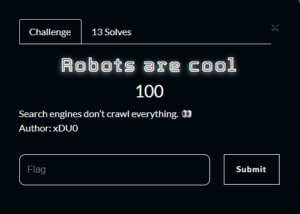

> **Difficulty:** very easy  <br>
> **Description:** Search engines don’t crawl everything. 👀  <br>
> **Author:** xDU0


---
### Goal
Find the hidden flag using common web enumeration logic.

### Key idea
Web servers can expose a `robots.txt` file, which tells search engines (and anyone curious) which paths should **not** be crawled. CTFs often use it as a hint to interesting hidden routes.

### Recon
The challenge statement didn’t provide a direct website URL, so the intended step is to check the **CTF platform page** for the challenge instance/link.

From the platform, the target domain was:
- `https://www.ctfplatform.online/`

### Solution
Navigate to `robots.txt`:

- `https://www.ctfplatform.online/robots.txt`

 It reveals:
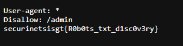
The flag is directly present in the file.

### Flag :
```
securinetsisgt{R0b0ts_txt_d1sc0v3ry}
```
---
## 🍪 Cookies (300 pts)
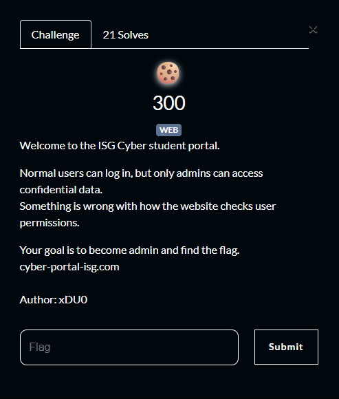

> **Difficulty:** `easy`  <br>
> **Description:** Welcome to the ISG Cyber student portal.  
> Normal users can log in, but only admins can access confidential data.  
> Something is wrong with how the website checks user permissions.  
>
> **Goal:** Become admin and retrieve the flag.  
> **Target:** `cyber-portal-isg.com`  
> **Author:** xDU0

### Goal
Gain access to the **Admin** area by exploiting a broken authorization / client-side trust issue, then grab the flag.

### What to notice
The portal provides valid student credentials directly on the login page (e.g. `user / user123`).  
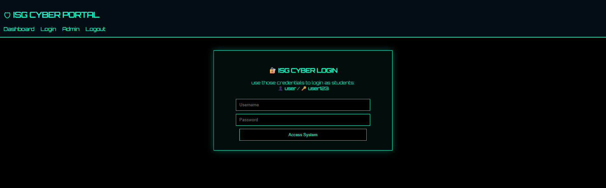

After logging in, clicking **Admin** results in an “Access Denied / role insufficient” message — meaning the website is checking a “role” somewhere.
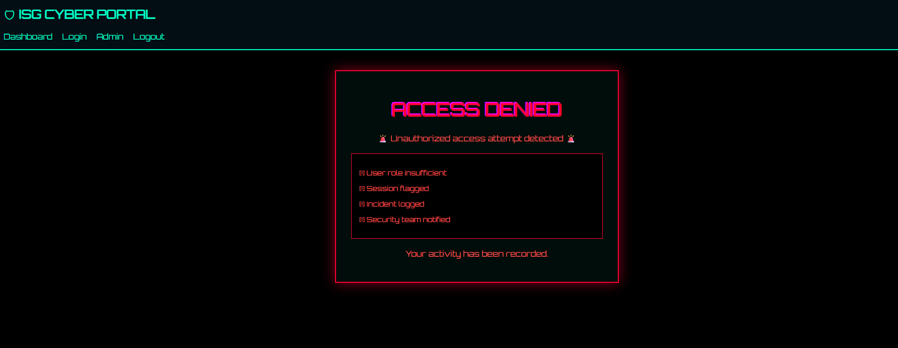


### Step 1 — Log in as a normal user
Use the given credentials:
- **Username:** `user`
- **Password:** `user123`

You can confirm login succeeded by visiting the dashboard and seeing the navigation links including **Admin**.

### Step 2 — Inspect how the role is stored
Open DevTools (F12) → **Application** → **Cookies** (for the site).

You’ll find cookies like:
- `username = user`
- `role = student`

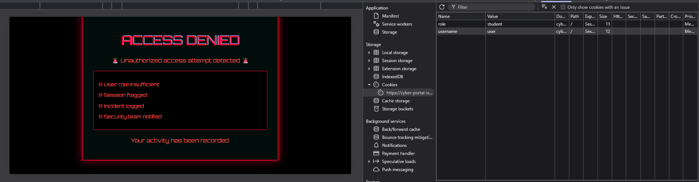

This is already a big red flag (pun intended): the application is trusting a **client-controlled cookie** to decide authorization.

### Step 3 — Privilege escalation via cookie tampering
Edit the cookie value:

- Change:
  - `role=student`
- To:
  - `role=admin`

Then refresh the page and open `/admin` (or click **Admin** again).

### Result
The admin panel becomes accessible and displays the flag.
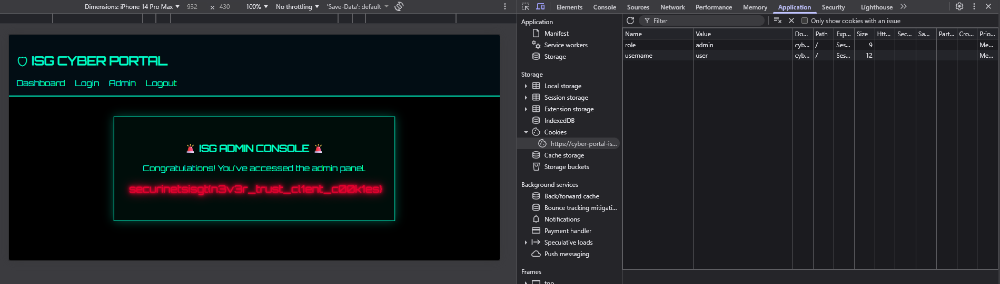

### Vulnerability
**Broken Access Control / Insecure Authorization**  
The backend trusts a user-controlled value (`role`) from the browser cookies instead of enforcing role checks server-side.

### Flag
```
securinetsisgt{n3v3r_trust_cl1ent_c00k1es}
```
---

## 🍪 v0.2 (500 pts)

> **Description:** The ISG Cyber student portal has been “fixed” after last time’s incident. But not really 👀  
> **Goal:** Become admin and find the flag.  
> **Target:** `cyber-portal-isg.com`  
> **Author:** xDU0

### Goal
Escalate privileges to **admin** and retrieve the flag from the admin panel.

### What changed from v0.1?
In the previous version, the role was stored in plaintext cookies (`role=student`) and could be edited directly.

In **v0.2**, the role is no longer readable—because it’s stored as a **serialized object** inside the cookie.

### Recon
1. Log in as the provided user (same as before).
2. Open DevTools → **Application** → **Cookies**.
3. You’ll see a cookie value that looks like Base64:

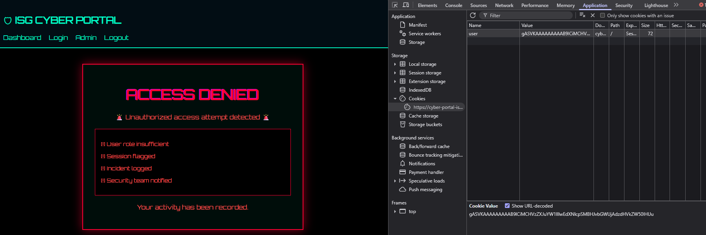


### Identify the format (Pickle)
Decode the Base64 and check the first bytes.

A Python Pickle (protocol 4) starts with:
- `0x80 0x04`  → in Python: `b"\x80\x04"`

So if the decoded bytes begin with `b"\x80\x04"`, it’s very likely a pickle payload.

### Step 1 — Decode the cookie (Base64 → Pickle → Python object)

```python
import base64
import pickle
import urllib.parse

cookie = "gASVKAAAAAAAAAB9lCiMCHVzZXJuYW1llIwEdXNlcpSMBHJvbGWUjAdzdHVkZW50lHUu"  # cookie value

cookie = urllib.parse.unquote(cookie)
data = base64.b64decode(cookie)

print(data[:10])  # should start with b'\x80\x04'
obj = pickle.loads(data, encoding="latin1")

print(obj)
```
Typical output:
```
b'\x80\x04\x95(\x00\x00\x00\x00\x00\x00'
{'username': 'user', 'role': 'student'}`
```
### Step 2 — Modify role and re-encode it back into a cookie

Create a new object with admin role, then pickle + base64 encode it:
```python
import base64
import pickle

obj = {'username': 'user', 'role': 'admin'}

payload = pickle.dumps(obj, protocol=4)
new_cookie = base64.b64encode(payload).decode()

print(new_cookie)

```

### Step 3 — Replace cookie in the browser

DevTools → Application → Cookies

Replace the original cookie value with your newly generated one

Refresh the page and go to /admin
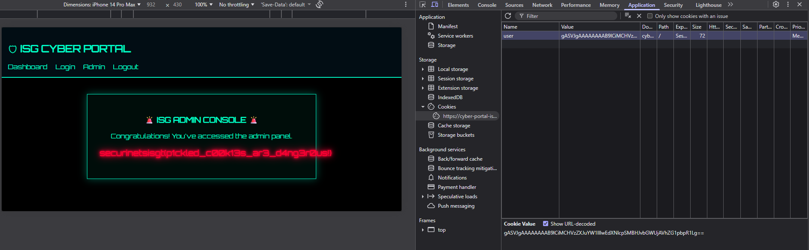

### Result

You now have admin access, and the page reveals the flag.

### Vulnerability
This is still broken access control: the server is trusting client-side data to decide authorization.

Even if it’s “encoded” or “serialized”, it’s still fully controlled by the user — encoding ≠ security.

### Flag
```
securinetsisgt{p1ckled_c00k13s_ar3_d4ng3r0us!}
```
---
# Reverse Engineering 
## Babyrev (475 pts) [easy]
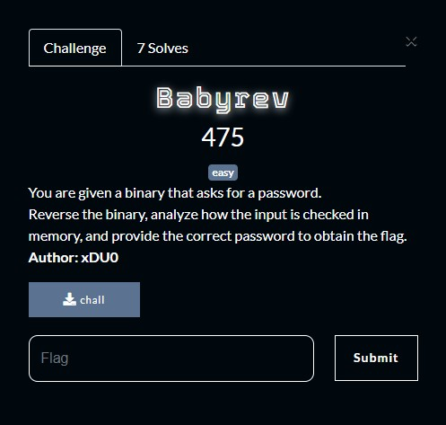

> **Description:** You are given a binary that asks for a password.  
> Reverse the binary, analyze how the input is checked in memory, and provide the correct password to obtain the flag.  
> **Author:** xDU0

### Goal
Find the correct **password** to make the program print the flag.

---

### Step 1 — Identify the binary
```bash
└─$ file chall
chall: ELF 64-bit LSB pie executable, x86-64, version 1 (SYSV), dynamically linked, interpreter /lib64/ld-linux-x86-64.so.2, BuildID[sha1]=9e56bd6caaa062a38d7a56d788f9a77bd569e66f, for GNU/Linux 3.2.0, stripped
```
So it’s a Linux x64 binary and stripped (no function names), but still easy to analyze.
### Step 2 — Quick recon (strings)
```bash
┌──(duo㉿xDU0)-[/]
└─$ strings -a chall
o/lib64/ld-linux-x86-64.so.2
mgUa
fgets
stdin
puts
putchar
strlen
strcspn
__libc_start_main
__cxa_finalize
printf
libc.so.6
GLIBC_2.34
GLIBC_2.2.5
_ITM_deregisterTMCloneTable
__gmon_start__
_ITM_registerTMCloneTable
PTE1
u+UH
Guess the password
ghaaaaaalt
;*3$"
GCC: (Debian 15.2.0-7) 15.2.0
.shstrtab
.note.gnu.property
.note.gnu.build-id
.interp
.gnu.hash
.dynsym
.dynstr
.gnu.version
.gnu.version_r
.rela.dyn
.rela.plt
.init
.plt.got
.text
.fini
.rodata
.eh_frame_hdr
.eh_frame
.note.ABI-tag
.init_array
.fini_array
.dynamic
.got.plt
.data
.bss
.comment
```
This shows the prompt and the “wrong password” message, but not the password/flag directly.

### Step 3 — Disassemble and locate the password check

> **Note:** You can use **any disassembler/decompiler**, not only Ghidra.  
> (Ghidra, IDA, Binary Ninja, Cutter/radare2, Hopper… all work fine.)
### 1) Import & analyze
- `File → New Project`
- Import the binary
- Run **Auto-Analysis** (default settings)

### 2) Locate the main logic
A fast way is:
- `Search → For Strings…`
- Find the prompt string (the one printed before reading input)
- Follow **References** to reach the function that handles input.

In this binary, the relevant function is:
- `FUN_00101189`
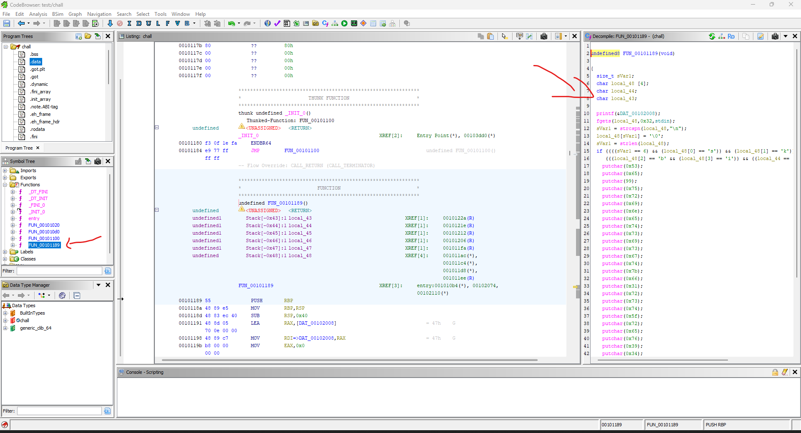

### 3) Understand the password check (Decompiler)
In the decompiler, `FUN_00101189` does:

1. Prints a prompt (`printf`)
2. Reads input (`fgets`)
3. Removes the newline (`strcspn`)
4. Checks length (`strlen`)
5. Verifies characters one by one

The important part:

```c
sVar1 = strlen(local_48);
if (sVar1 == 6 &&
    local_48[0] == 's' &&
    local_48[1] == 'k' &&
    local_48[2] == 'b' &&
    local_48[3] == 'i' &&
    local_44    == 'd' &&
    local_43    == 'i')
{
    // prints flag with putchar(...)
}
```
#### Why are the last two chars local_44 and local_43?

Ghidra shows local_48 as char[4], but the program reads up to 0x32 bytes into it:

fgets(local_48, 0x32, stdin);

So the input spills into adjacent stack bytes (local_44, local_43). That’s why the last two checks appear outside local_48.

### 4) Extract the password

From the comparisons, the 6 required characters are:

✅ Password: `skbidi`

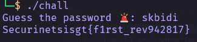
### Flag
```
Securinetsisgt{f1rst_rev942817}
```
---
# Hardware
##  Blinking Secrets (300 pts)
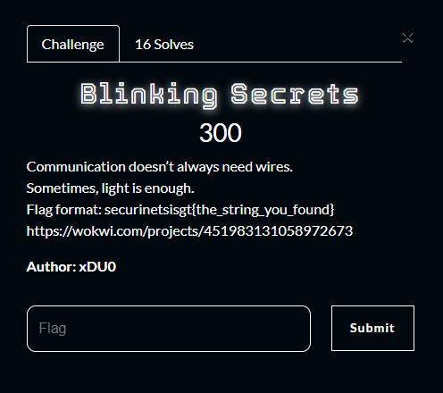

> **Description:** Communication doesn’t always need wires. Sometimes, light is enough.  
> **Flag format:** `securinetsisgt{the_string_you_found}`  
> **Link:** https://wokwi.com/projects/451983131058972673  
> **Author:** xDU0

### Idea
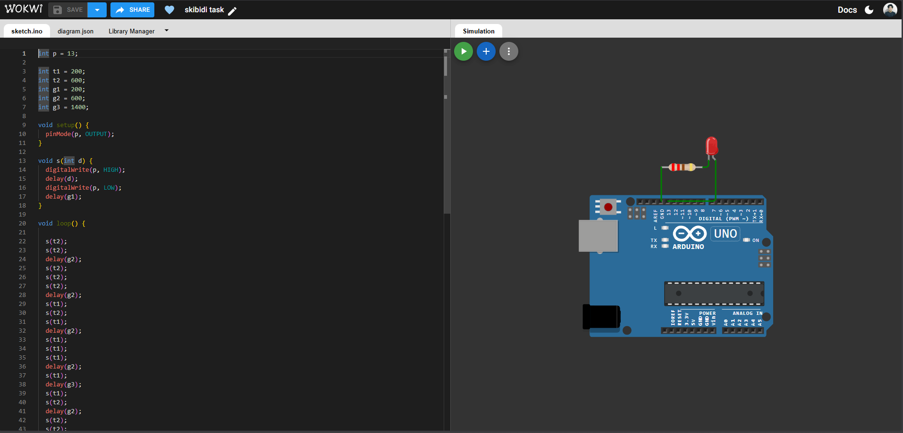
The Wokwi project blinks an LED on pin **13** using two pulse lengths:
- `t1 = 200ms` (short)
- `t2 = 600ms` (long)

And it uses gaps that match **Morse code timing**:
- `g1 = 200ms` gap between symbols (dot/dash)
- `g2 = 600ms` gap between letters
- `g3 = 1400ms` gap between words :contentReference[oaicite:0]{index=0}

So:  
- short blink (`t1`) = dot `.`  
- long blink (`t2`) = dash `-`

### Read the blink sequence
In `loop()`, the program calls `s(t1)` / `s(t2)` in groups separated by `delay(g2)` (new letter) and `delay(g3)` (new word). :contentReference[oaicite:1]{index=1}

Decoded letter by letter:

- `--` → **M**
- `---` → **O**
- `.-.` → **R**
- `...` → **S**
- `.` → **E**
(word gap)
- `.-` → **A**
- `--.` → **G**
- `.-` → **A**
- `..` → **I**
- `-.` → **N**

Message: **`MORSEAGAIN`**

### Flag
```
securinetsisgt{morseagain}
```
---

## Circuit (460 pts)

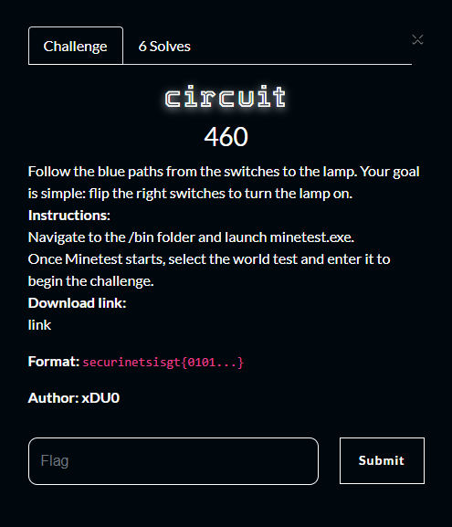
> **Description:** Follow the blue paths from the switches to the lamp. Your goal is simple: flip the right switches to turn the lamp on.  
> **Format:** `securinetsisgt{0101...}`  
> **Author:** xDU0

### Setup
1. Extract the provided challenge zip.
2. Go to the `bin/` folder and run `minetest.exe`.
3. In the main menu, select the world **`test`** and click **Play Game**.
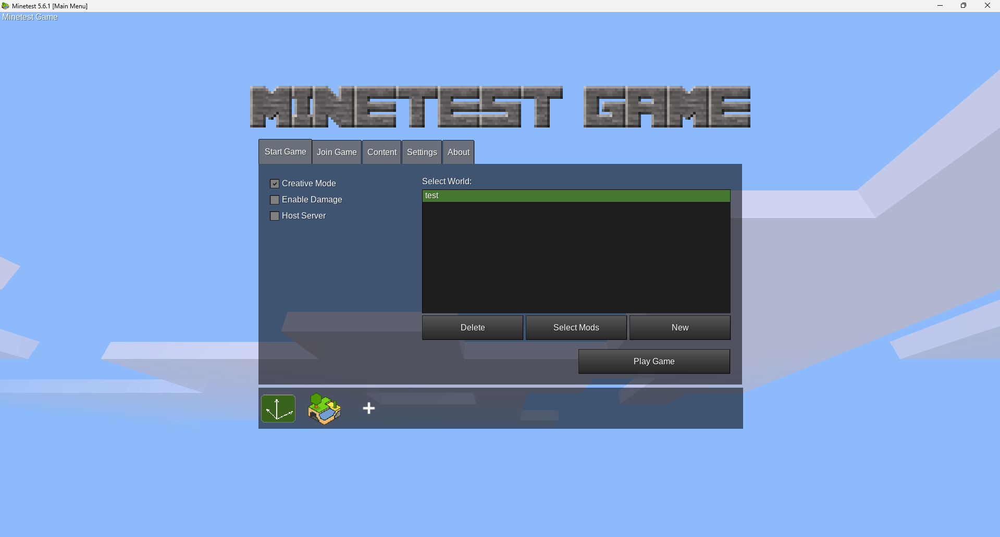
Inside the world, you’ll find a logic circuit made of:
(whole circuit view)
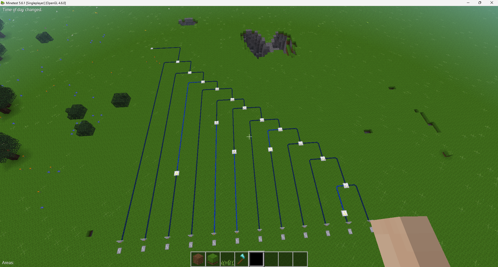

- **Levers** (inputs) named **A → L** (the labels are placed near each lever)
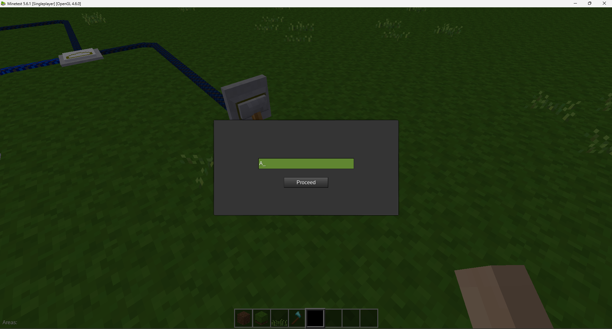

- **Logic gates** (NOT / AND)
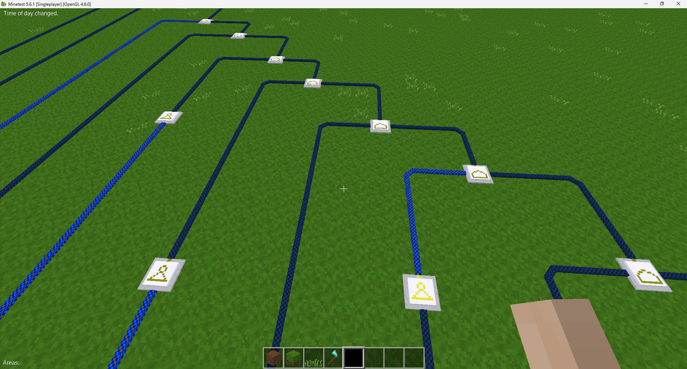
- A **lamp** (output)

### Goal
Turn the **lamp ON** by setting the correct lever positions.

---

### Quick logic gates recap

**NOT gate** (inverts input):  
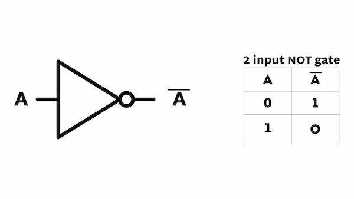

**AND gate** (1 only if both are 1):  
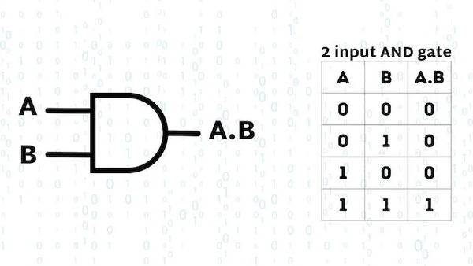

---

### Understanding the circuit

#### Lever values
Each lever represents a single bit:
- **OFF / Down** → `0`
- **ON / Up** → `1`

#### Gates used
- **NOT** gate: inverts the input (`0→1`, `1→0`)
- **AND** gate: outputs `1` only if both inputs are `1`

The blue wiring helps you trace which signals feed each gate. The intended solving method is to follow the paths and deduce which inputs must be `1` (and which must be `0` when they pass through a NOT gate) until the final output becomes true and the lamp lights up.

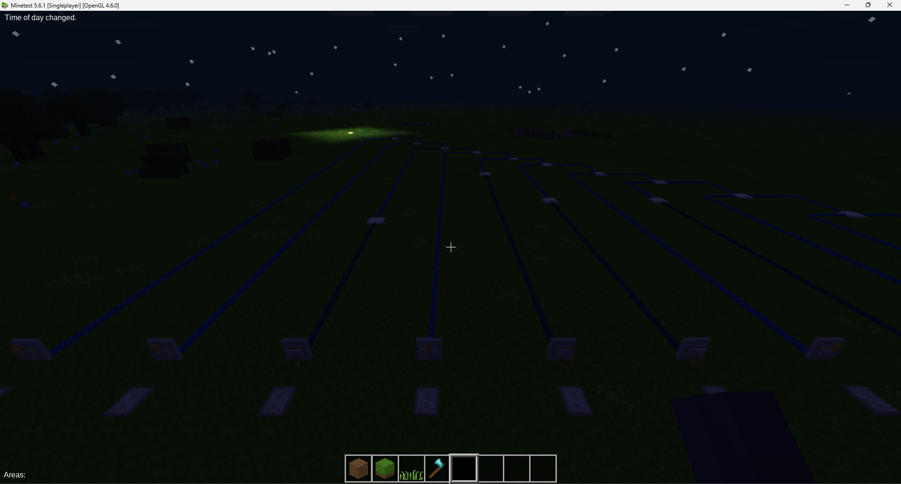

---

### Solution
After analyzing the paths and flipping the levers accordingly, the lamp turns **ON** when the inputs (A → L) form the following binary sequence:

`101101001011`

### Flag
```
securinetsisgt{101101001011}
```
---

# OSINT
## Where the Sea Once Ruled (110 pts)
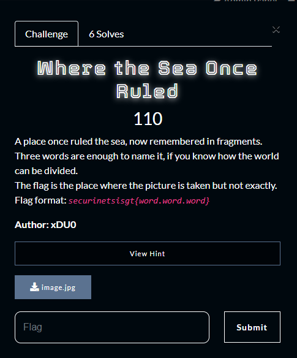

> **Description:** A place once ruled the sea, now remembered in fragments.  
> Three words are enough to name it, if you know how the world can be divided.  
> The flag is the place where the picture is taken **but not exactly**.  
>
> **Hint:** where there's a scenic spot named **"point of .."**  
> **Format:** `securinetsisgt{word.word.word}`  
> **Author:** xDU0

### Goal
Identify the location shown in the photo, then convert the (approximate) spot into a **what3words** address.

---

### Step 1 — Identify the place (Google Maps)

From the image:
- small fishing boats on calm water
- Mediterranean/North African vibe
- the hint mentions a scenic spot named **“point of …”**

Searching on Google Maps for scenic spots around **Carthage** leads to:

✅ **Point of Carthage by the sea**

This matches the hint and fits the “sea once ruled” theme (Carthage’s historical naval power).

---

### Step 2 — Convert the spot to what3words
The challenge says the flag is the place where the picture is taken **but not exactly**, meaning:
- we should use a *nearby exact 3m x 3m square* instead of a general pin.

1. Go to: https://what3words.com/
2. **Make sure the language is set to English** (important, because words change with language).
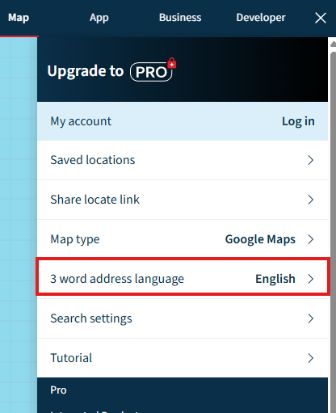
3. Search for **Point of Carthage by the sea**.
4. Click the correct square near the scenic spot marker.

The selected square gives:<br/>
✅ `hush.washed.stunning`

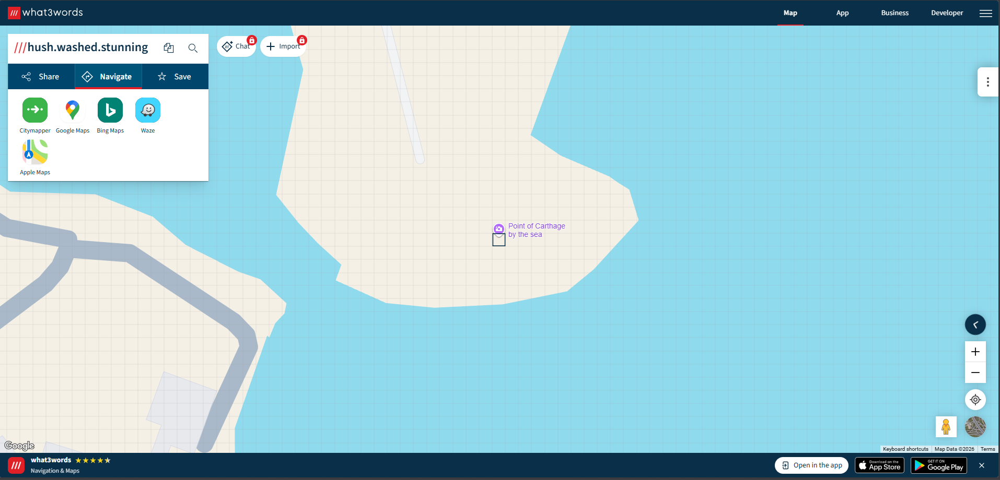
---

### Flag
```
securinetsisgt{hush.washed.stunning}
```

> **Note**: any valid what3words square **on the exact Point of Carthage by the sea area** can be accepted .

---
# Steganography
## ما دڨليش بوناني (150 pts)
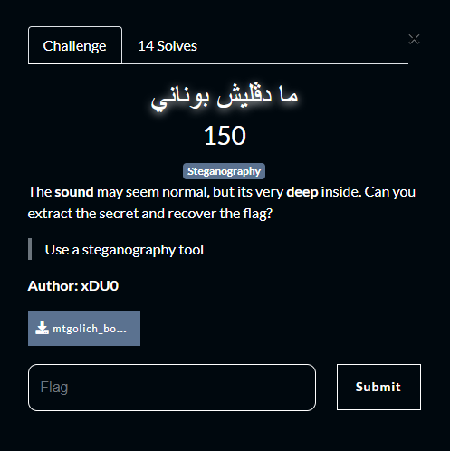

> **Description:** The sound may seem normal, but its very deep inside.  
> Can you extract the secret and recover the flag?  
>
> **Hint:** Use a steganography tool  
> **Author:** xDU0

### Goal
Extract the hidden data embedded inside the provided audio file and recover the flag.

---

### Solution

#### 1) Open the audio in DeepSound
DeepSound is a common audio-steganography tool that can detect and extract embedded files from `.wav`/audio containers.
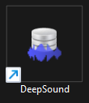

1. Launch **DeepSound**
2. Click **Open Carrier File**
3. Select the provided audio file

DeepSound detects that the audio contains an embedded payload.

#### 2) Extract the hidden file
1. Go to **Extract Secret Files**
2. Choose an output folder
3. Extract the embedded content
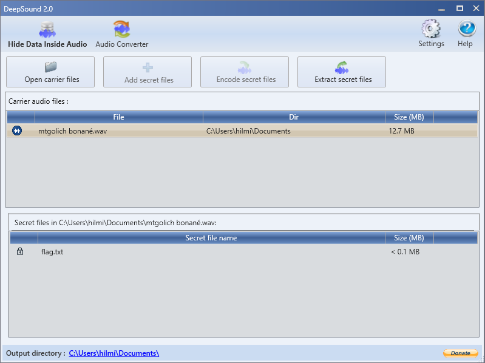

The tool outputs a file named:

✅ `flag.txt`

#### 3) Read the flag
Open `flag.txt` and copy the content inside.

### Flag
```
securinetsisgt{H1dd3N_1n_AUd10}
```

---
# MISC 
## Arcane🚪 (270 pts)

> **Description:** ArcaneDoor is a 2024 cyber espionage campaign targeting network perimeter devices. The attackers deployed custom implants on Cisco appliances, enabling long-term persistence and covert command execution. Refer to the MITRE ATT&CK framework to answer the following questions and obtain the flag.  
> **Service:** `nc 4.tcp.eu.ngrok.io 15799`  
> **Author:** xDU0

### Goal
Connect to the remote service and answer a sequence of MITRE ATT&CK questions about the **ArcaneDoor** campaign.After all correct answers, the service returns the flag.

---

### Step 1 — Connect to the service
```bash
nc 4.tcp.eu.ngrok.io 15799
```
You’ll be prompted with multiple questions.
you will find everything you need here : [mitre att&ck](https://attack.mitre.org/campaigns/C0046/)
```bash
┌──(duo㉿xDU0)-[~]
└─$ nc 0.tcp.eu.ngrok.io 12955
[+] NOTE: You have 3 attempts on each question before the connection is closed! GL HF
==============================================================================
What is one of the alternative names used by Microsoft for the group behind this campaign?
=> STORM-1849
[+] Correct!
What is the Cisco Talos tracking name for the threat actor group?
=> UAT4356
[+] Correct!
In which month and year was the campaign first observed? (month year)
=> July 2023
[+] Correct!
Until which month and year was activity from this campaign observed? (month year)
=> April 2024
[+] Correct!
Which technique ID corresponds to 'Exploit Public-Facing Application' used for initial access?
=> T1190
[+] Correct!
Which technique ID was used for 'Process Injection' (into AAA and Crash Dump processes)?
=> T1055
[+] Correct!
Which technique ID describes the use of 'Network Sniffing' / packet capture for data collection?
=> T1040
[+] Correct!
Which technique ID corresponds to 'Command and Control' conducted through HTTP?
=> T1071.001
[+] Correct!
Which technique ID was used for 'Disabling logging' on the targeted Cisco ASA appliances?
=> T1562.003
[+] Correct!
Which technique ID describes 'Masquerading' using digital certificates that mimic Cisco ASA formatting?
=> T1036
[+] Correct!
What was the product or solution that was targeted by the group?
=> Cisco ASA
[+] Correct!
What CVE is attributed to the vulnerability that was abused? (CVE-YYYY-NNNN)
=> CVE-2024-20353
[+] Correct!
What's the software ID of the malware used as the primary backdoor?
=> S1188
[+] Correct!
What was the malware's name during the campaign?
=> Line Runner
[+] Correct!
What's the software ID of the secondary malware used for persistence?
=> S1186
[+] Correct!
What was the malware's name during the campaign?
=> Line Dancer
[+] Correct!
Which protocol was used by the group for command and control?
=> HTTPS
[+] Correct!

securinetsisgt{Arc4n3D00r_C1sc0_1mpl4nts_M1Tr3}
```
### Flag
```
securinetsisgt{Arc4n3D00r_C1sc0_1mpl4nts_M1Tr3}
```

---
# Encoding
## Hex Marks the Spot (100 pts)

> **Description:** Every two characters represent something meaningful. Decode the message.  
> **Given:**  
> `115 101 99 117 114 105 110 101 116 115 105 115 103 116 123 72 51 88 95 77 51 83 83 52 71 51 125`  
> **Author:** xDU0

### Goal
Decode the sequence into the flag.

---

### Decoding using [dCode.fr](https://www.dcode.fr/)


1. Use the cipher detector
Go to **dCode.fr** and open the **cipher detector** (Détecteur de codes).
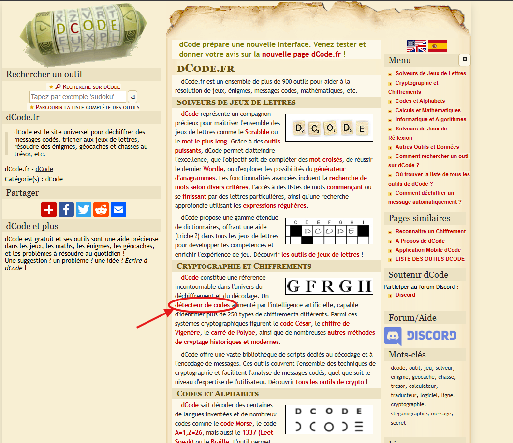
Paste the encoded message
Click **Analyser**.

The detector suggests **Code ASCII** as the most likely encoding.
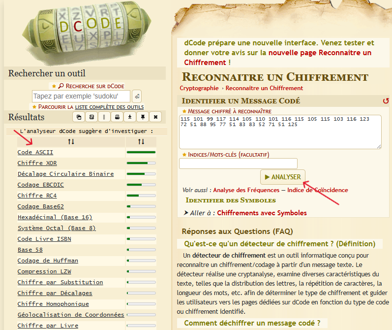
2. Decode using ASCII tool
Open the **Code ASCII** tool (still on dCode), paste the same numbers, and click **Déchiffrer/Convertir ASCII**.
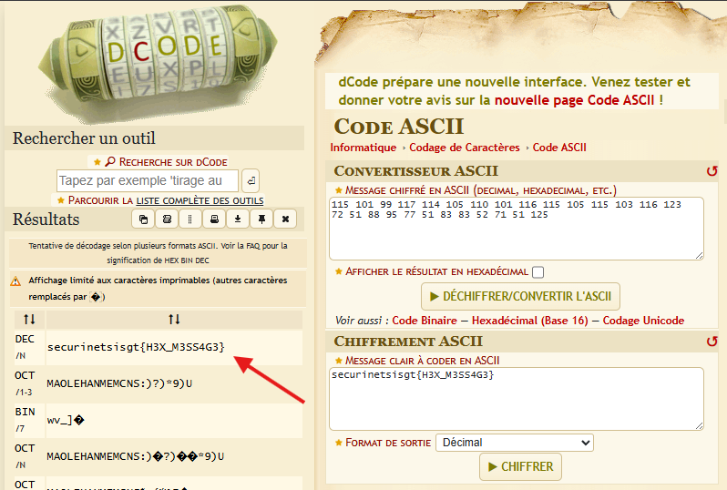


---

### Decoding using [CyberChef](https://gchq.github.io/CyberChef/)
1. Open **CyberChef**.

2. Paste the encoded numbers into the **Input** box:
3. From the left sidebar, search for **Magic** and drag it into the **Recipe** panel.
4. Click **Bake!** (or keep Auto Bake enabled).

CyberChef will automatically detect the best decoding chain and suggest a recipe like:
- `From Decimal('Space', false)`
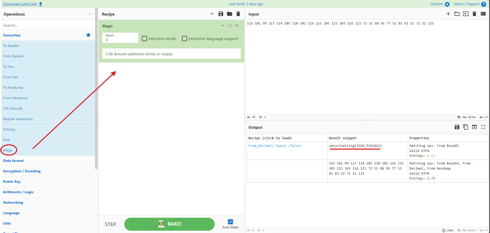
---

### Flag
```
securinetsisgt{H3X_M3SS4G3}
```
---
# Final words

To all Securinets ISGT members: thank you for the energy, the teamwork, and the late-night grind.  
Every solved challenge is a small win, but the real achievement is the mindset you build: analysis, patience, and resilience.

Keep hacking ethically, keep sharing knowledge, and keep pushing each other upward.  
This is only the beginning. 🚀