# HTB Sherlock: Baggage — Shellbag Forensics Write-up

**Category:** Digital Forensics & Incident Response (DFIR)
**Artifact type:** Windows Registry — Shellbags (+ RecentDocs corroboration)
**Sherlock:** Baggage — **Very Easy**, created by **CyberJunkie**, released **2026-08-13**.
**Scenario:** Shellbag artifacts can reveal folder access, network-share access, and navigation within archive files. This investigation uses those traces to assess potential data access, staging, and exfiltration activity.

**Tooling used:** Registry Explorer + ShellBags Explorer (Eric Zimmerman tools), v2026.5.0.

**All 10 tasks solved — answers verified correct.** ✅

---

## 1. What Are Shellbags?

Whenever a user opens a folder in Windows Explorer, Windows silently records that folder's name, its **position in the folder tree**, and timestamps in the registry — even if the folder is later deleted, renamed, or was actually inside an archive, a removable drive, or a network share. This happens so Explorer can remember window size/position/view settings the next time you open that folder.

These records are called **shellbags**, and they live in two hives, depending on Windows version and folder type:

| Hive | Key | Stores |
|---|---|---|
| `NTUSER.DAT` | `Software\Microsoft\Windows\Shell\BagMRU` | Shellbags for older folder types / some network paths |
| `UsrClass.dat` | `Local Settings\Software\Microsoft\Windows\Shell\BagMRU` | Shellbags for most modern folder types (local, network, and **archive contents** — zip/7z opened in Explorer look like folders!) |

Each subkey under `BagMRU` is a node in a tree that mirrors the folder hierarchy the user navigated (e.g. `BagMRU\1\2\0` = 3 levels deep). The **value** at each node (named `0`, `1`, `2`...) contains a binary-encoded **shell item** holding the folder's name and embedded FILETIME timestamps.

### ⚠️ Important: two different "timestamps" live on every shellbag node — don't mix them up

Every decoded shellbag node in ShellBags Explorer shows **two separate sets of times**, and it's easy to grab the wrong one:

1. **"Target timestamps" (Created on / Modified on / Accessed on)** — these are copied from the target folder/file's *own* filesystem MAC attributes at the moment the shell item was captured. They can be **stale or misleading** — e.g. if a file was copied from elsewhere, its "Accessed on" may reflect an old access time from before it ever reached this machine, not when the attacker actually looked at it here.
2. **"Registry last write time"** — this is the last-write timestamp on the **registry key itself**. Since Windows only (re)writes a BagMRU key when the corresponding folder is actually opened/browsed in Explorer, **this is the far more reliable indicator of when the attacker interacted with that folder**, independent of whatever MAC times the target item happened to carry.

Every "when was X accessed by the attacker" question in this Sherlock is answered by the **Registry last write time**, not the Target "Accessed on" field. This tripped me up initially — I'll call it out explicitly on every task where it matters.

---

## 2. Evidence Provided

```
NTUSER.DAT          + ntuser.dat.LOG1 / .LOG2       (victim's user hive)
UsrClass.dat        + UsrClass.dat.LOG1 / .LOG2     (victim's per-user classes hive)
```

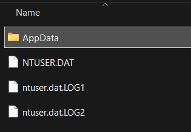
*Figure 1 — the provided hive + transaction log files (`NTUSER.DAT` side shown here).*

---

## 3. Tooling Setup

1. Open **Registry Explorer** → **File → Load hive** → load `NTUSER.DAT` and `UsrClass.dat`.
2. Apply the `.LOG1`/`.LOG2` transaction logs when prompted, so any un-flushed registry writes are replayed.
3. Go to **Tools → Shell Bags Explorer**. This decodes every shell item under `BagMRU`/`Bags` automatically and presents a clean tree of **real, human-readable folder names**, with columns for Created On / Modified On / Accessed On / First Interacted / Last Interacted, plus a Summary panel per node showing both the Target timestamps *and* the Registry last write time (see the note in Section 1).

The reconstructed tree (from `UsrClass.dat`) mirrors exactly what the attacker browsed:

```
Desktop
└─ This PC
   ├─ Pictures
   │  ├─ a.zip
   │  │  └─ a
   │  │     ├─ OT Station 3 internal VPN/a/
   │  │     ├─ OnePassword MasterPass/a/
   │  │     └─ Engineers Tab/a/
   │  └─ a
   ├─ Documents
   │  ├─ OT Station 3 internal VPN
   │  ├─ Engineers Tab
   │  └─ OnePassword MasterPass
   ├─ Downloads
   │  └─ 1.zip
   └─ Shared Documents Folder (Users Files)
      └─ AppData\Local\Temp
         ├─ Temp1_a.zip\a
         └─ Temp1_1.zip\1
└─ Computers and Devices
   └─ Prod-ns-2
      └─ \\Prod-ns-2\prodshare
         └─ Construction 2027
```

---

## 4. Reconstructed Timeline (UTC, 2025-09-03)

| Time | Action |
|---|---|
| 07:31:05 | VPN folder (`OT Station 3 internal VPN`) browsed |
| 07:34:04 | `Construction 2027` (network share) browsed, confirming the attacker looked at `Dam Construction Engineer Plans.zip` |
| 07:34:30 | Exfiltration archive `a.zip` opened/interacted with |

(Target MAC timestamps on individual items are older/earlier and reflect original file dates, not attacker activity — see Section 1.)

---

## 5. Task-by-Task Walkthrough
### Task 1 — Archive downloaded by the compromised account

The decoded `Downloads` branch shows a single child shell item: **`1.zip`**, independently corroborated by `NTUSER.DAT`'s `RecentDocs\.zip` key:

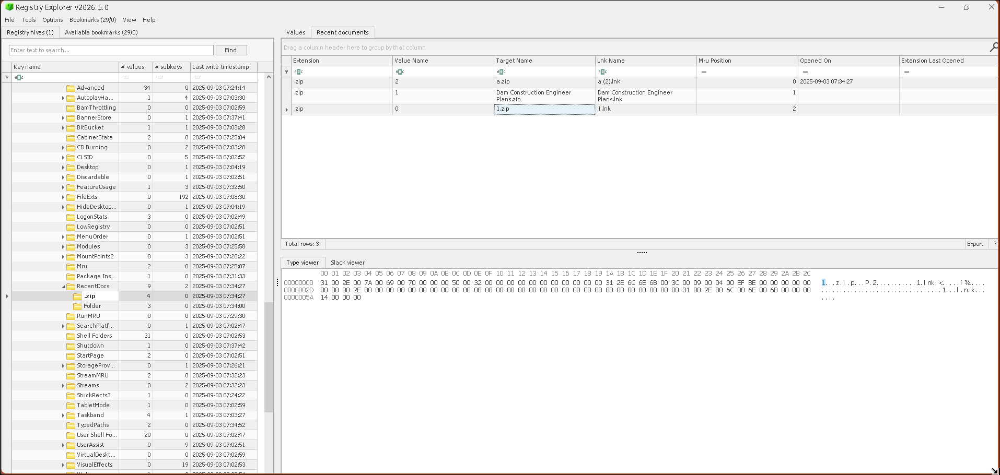
*Figure 2 — `NTUSER.DAT\Software\Microsoft\Windows\CurrentVersion\Explorer\RecentDocs\.zip`: all three zip files the attacker touched appear in the jump-list history, each with a matching `.lnk` shortcut — `a.zip` (MRU position 0, Opened On 2025-09-03 07:34:27), `Dam Construction Engineer Plans.zip` (position 1), and `1.zip` (position 2). The `a.zip` "Opened On" value (07:34:27) lines up almost exactly with the Registry last write time we used for Task 10 (07:34:30) — two independent artifacts agreeing within a few seconds of each other.*

**✅ Answer: `1.zip`**

---

### Task 2 — Utility brought in by the attacker

Explorer was used to browse **inside** `1.zip` (visible as the `...\AppData\Local\Temp\Temp1_1.zip\1` branch — Explorer mounts an opened zip's contents at a `Temp1_<name>` virtual path while browsing it), revealing a nested shell item: `Everything-1.4.1.1028.x64.zip`.

That's proof the archive was *browsed*, but **UserAssist** (`NTUSER.DAT\Software\Microsoft\Windows\CurrentVersion\Explorer\UserAssist`) proves it was actually **executed**:

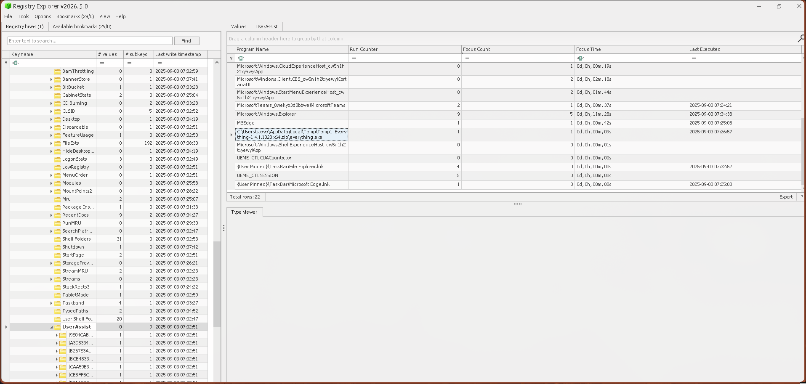
*Figure 2b — UserAssist program-execution tracking shows `C:\Users\steve\AppData\Local\Temp\Temp1_Everything-1.4.1.1028.x64.zip\everything.exe`, Run Counter **1**, Focus Time 0h 0m 9s, Last Executed **2025-09-03 07:26:57**. This is the strongest possible evidence for Task 2 — not just that the attacker saw the tool while browsing the zip, but that they actually launched it.*

**✅ Answer: `Everything 1.4.1.1028`** (the "Everything" instant filename-search utility by voidtools — commonly abused post-compromise for rapid keyword/filename searches across a whole filesystem)

---


### Task 3 — VPN folder access time

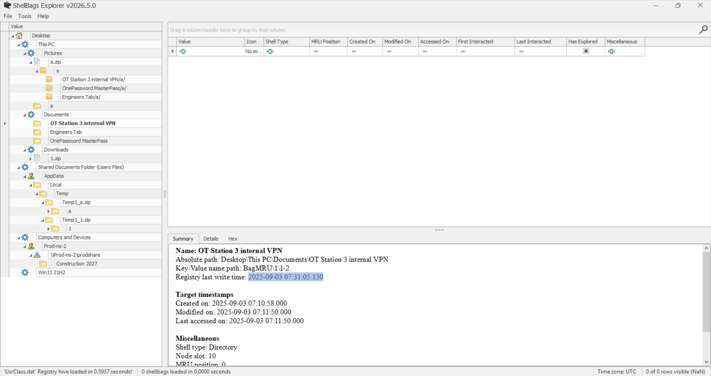
*Figure 3 — `Documents\OT Station 3 internal VPN` (`BagMRU\1\1-2`). Target timestamps show Created 07:10:58 / Modified & Accessed 07:11:50 — but the highlighted field, **Registry last write time: 2025-09-03 07:31:05.130**, is the actual moment this folder was browsed by the attacker.*

**✅ Answer: 2025-09-03 07:31:05 UTC**

---

### Task 4 — Directory containing the victim's passwords

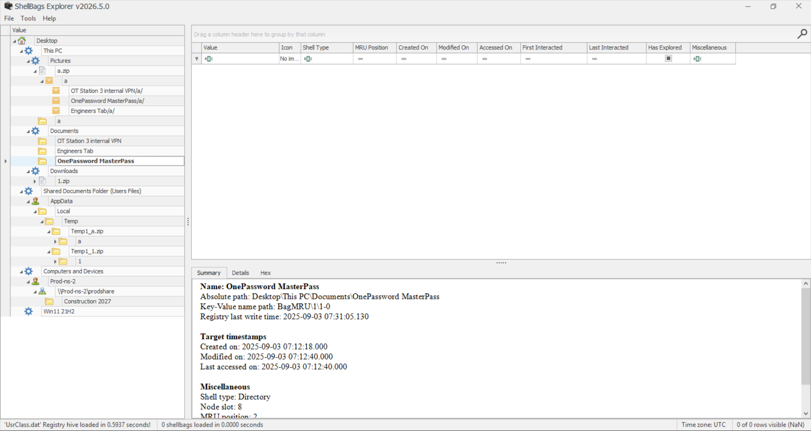
*Figure 4 — `Documents\OnePassword MasterPass` (`BagMRU\1\1-0`).*

The name is a strong giveaway — a local folder masquerading as/adjacent to a password manager vault.

**✅ Answer: `OnePassword MasterPass`**

---

### Task 5 — UNC path of the accessed network share

Shellbags also record **network location** shell items whenever a UNC path is browsed in Explorer.

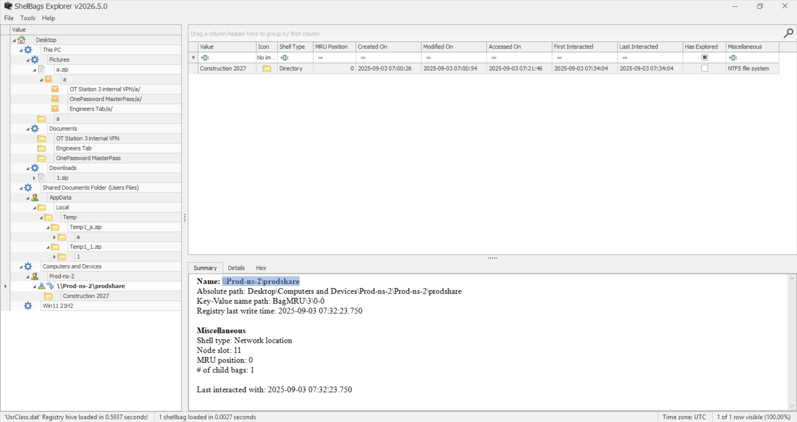
*Figure 5 — `\\Prod-ns-2\prodshare` (`BagMRU\3\0-0`), Shell type: **Network location**, 1 child bag (`Construction 2027`).*

**✅ Answer: `\\Prod-ns-2\prodshare`**

---

### Task 6 — When is the dam construction planned?

One level under the share, the attacker browsed a folder literally named `Construction 2027`:

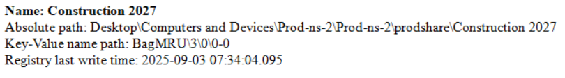
*Figure 6a — `\\Prod-ns-2\prodshare\Construction 2027` (`BagMRU\3\0\0-0`).*

**✅ Answer: 2027**

---

### Task 7 — Archive file present on the network share

`RecentDocs` in `NTUSER.DAT` directly names the file interacted with on the share:

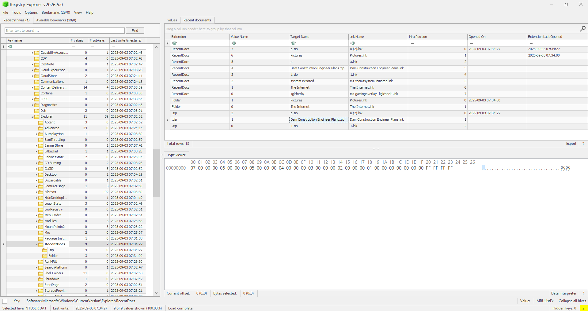
*Figure 7 — `NTUSER.DAT\...\RecentDocs\.zip`: Target Name **`Dam Construction Engineer Plans.zip`**, Lnk Name `Dam Construction Engineer Plans.lnk`.*

**✅ Answer: `Dam Construction Engineer Plans.zip`**

---

### Task 8 — Access time of the network-share archive

This is the **`Construction 2027`** shellbag node's own **Registry last write time** — the moment Windows wrote this folder's BagMRU entry, i.e. when the attacker actually browsed into it (and, by extension, encountered/accessed `Dam Construction Engineer Plans.zip` inside it):

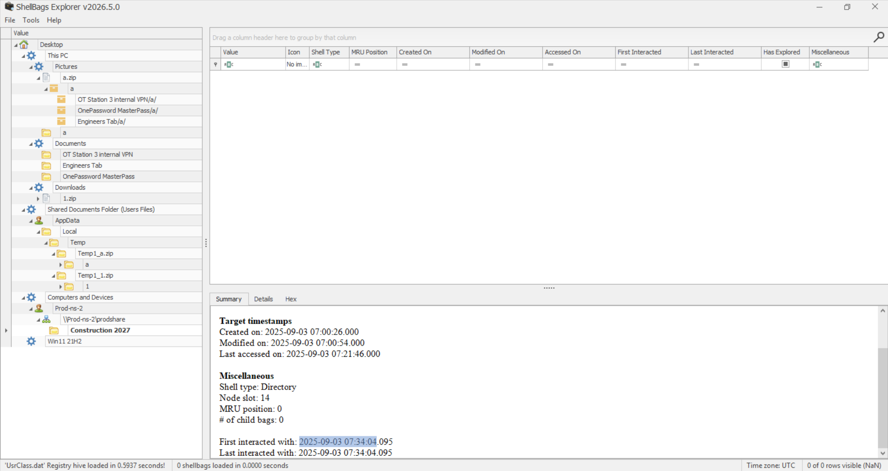
*Figure 8 — `Construction 2027` Summary panel: Target "Last accessed on" shows 07:21:46 (the folder's own stale filesystem attribute, copied over the network — **not** the right field here), but **Registry last write time: 2025-09-03 07:34:04.095** is the real access event.*

**✅ Answer: 2025-09-03 07:34:04 UTC**

---

### Task 9 — Full path of the staging folder

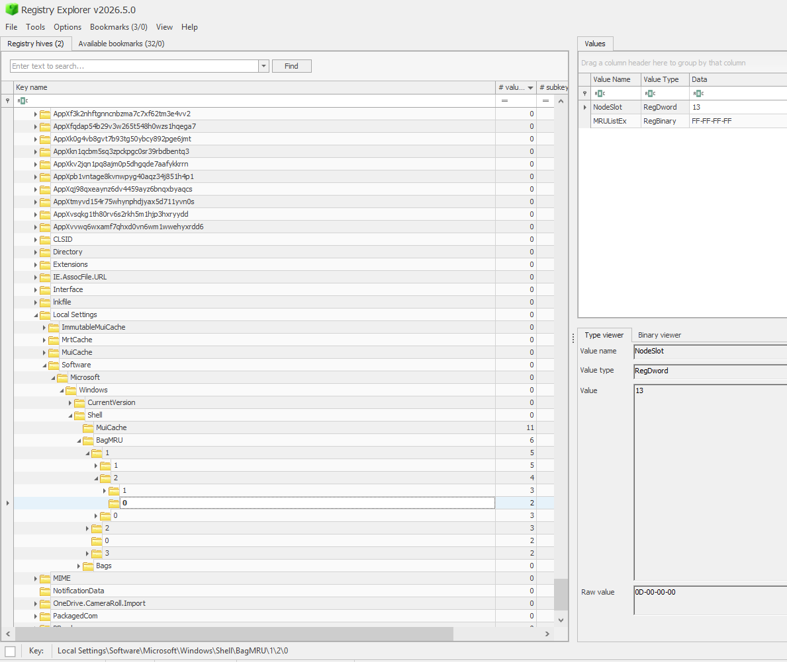
*Figure 9 — Registry Explorer, raw key browsing: `Local Settings\Software\Microsoft\Windows\Shell\BagMRU\1\2\0`. The raw key only exposes bookkeeping values (`NodeSlot = 13`, `MRUListEx = FF FF FF FF` i.e. empty). The decoded name itself lives in value `0` on the **parent** key (`BagMRU\1\2`) — which is why a dedicated decoder tool, not manual key-browsing, is the right approach.*

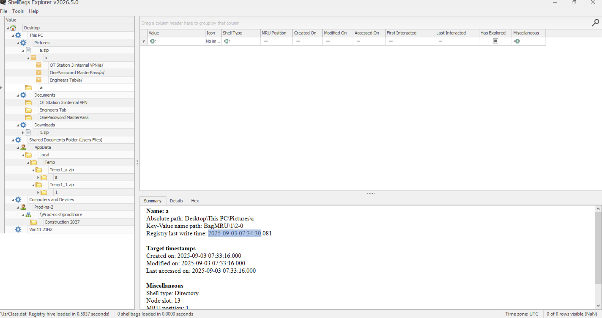
*Figure 10 — ShellBags Explorer decodes that same node: Absolute path **`Desktop\This PC\Pictures\a`** (`BagMRU\1\2-0`), Node slot 13 (matches Figure 9), Created/Modified/Accessed all **2025-09-03 07:33:16** — the folder didn't exist before the attacker created it mid-session.*

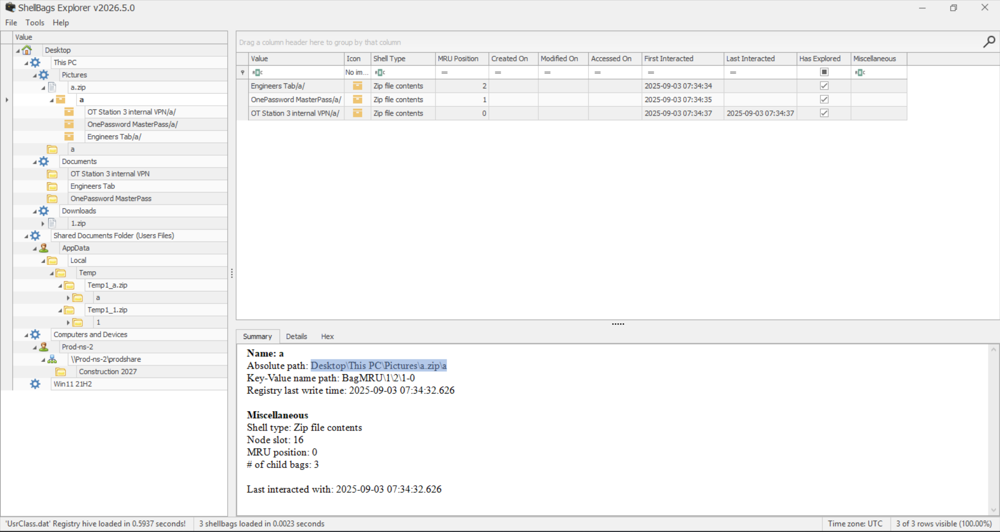
*Figure 11 — bonus corroboration: the later `a.zip` contains an `a` folder holding **`OT Station 3 internal VPN/a/`**, **`OnePassword MasterPass/a/`**, and **`Engineers Tab/a/`** — confirming the staging folder collected copies of exactly the sensitive folders found in Tasks 3 & 4, before compression.*

Resolving the virtual `Desktop\This PC\Pictures` path to a real filesystem path via `NTUSER.DAT`'s `Shell Folders` key (`My Pictures` value) confirms the victim's Windows username is **`steve`**:

```
NTUSER.DAT → Software\Microsoft\Windows\CurrentVersion\Explorer\Shell Folders
    "My Pictures" = C:\Users\steve\Pictures
```

**✅ Answer: `C:\Users\steve\Pictures\a`**

---

### Task 10 — Access time of the exfiltration archive

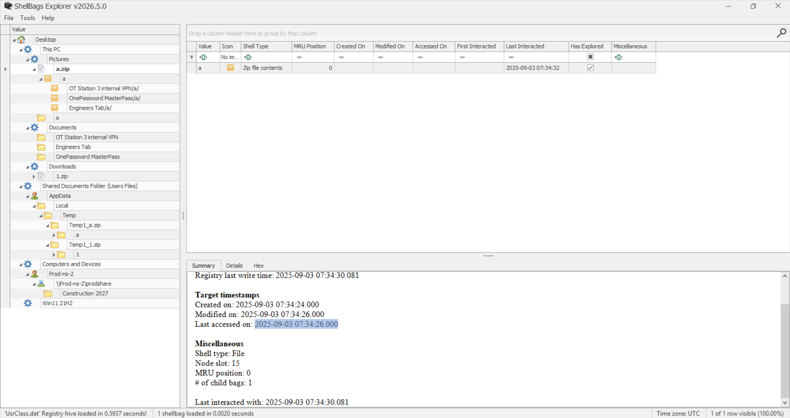
*Figure 12 — `Pictures\a.zip` Summary panel: Target timestamps show Created 07:34:24 / Modified & Accessed 07:34:26, but once again the correct answer is the node's own **Registry last write time: 2025-09-03 07:34:30.081** (highlighted) — the actual moment this archive was interacted with in Explorer.*

**✅ Answer: 2025-09-03 07:34:30 UTC**

---

## 6. Full Reconstructed Attack Narrative

1. Attacker gains access to `steve`'s account.
2. Pivots to a network share, `\\Prod-ns-2\prodshare`, and browses `Construction 2027` (registry last write 07:34:04), accessing `Dam Construction Engineer Plans.zip` inside it.
3. Browses sensitive personal folders on the local system: an internal VPN config folder (`OT Station 3 internal VPN`, registry last write 07:31:05) and what looks like a password vault folder (`OnePassword MasterPass`).
4. Downloads a toolkit archive, `1.zip`, containing the **Everything 1.4.1.1028** search utility — used to rapidly locate more files of interest by name across the filesystem.
5. Creates a new local staging folder, `C:\Users\steve\Pictures\a` (created 07:33:16), and copies the collected sensitive folders (`OT Station 3 internal VPN`, `OnePassword MasterPass`, `Engineers Tab`) into it.
6. Compresses the staging folder into `a.zip` in `Pictures`, interacting with it (registry last write 07:34:30) to prepare it for exfiltration.

---

## 7. Key Takeaways / Lessons for Defenders

- Shellbags persist **even after the folder/file/archive is deleted**, making them extremely valuable when an attacker tries to clean up after themselves.
- **Always prefer the shellbag's "Registry last write time" over its "Target Accessed on" field** when answering "when was this accessed/browsed" — the target timestamps are just copied filesystem metadata from the item itself and can be stale, especially for files that arrived via download or network copy; the registry last-write time is tied directly to the act of browsing the folder in Explorer.
- Shellbags record **archive browsing**, not just real folders — opening a `.zip` in Explorer leaves the same kind of trail as opening a normal directory, which is how we recovered proof of what was staged inside `a.zip` (Figure 11).
- The `RecentDocs` key is a great **independent corroborating artifact** alongside shellbags — it recorded the same three zip files (`1.zip`, `a.zip`, `Dam Construction Engineer Plans.zip`) from a completely different code path (Explorer's "recently opened documents" jump-list tracking).
- `Shell Folders` values in `NTUSER.DAT` are necessary to translate the GUID/known-folder references found in shellbags back into real, human-readable filesystem paths (and incidentally reveal the victim's Windows username, `steve`).

---

## Appendix — Final Answers

| Task | Answer |
|---|---|
| 1 | `1.zip` |
| 2 | `Everything 1.4.1.1028` |
| 3 | 2025-09-03 07:31:05 UTC |
| 4 | `OnePassword MasterPass` |
| 5 | `\\Prod-ns-2\prodshare` |
| 6 | 2027 |
| 7 | `Dam Construction Engineer Plans.zip` |
| 8 | 2025-09-03 07:34:04 UTC |
| 9 | `C:\Users\steve\Pictures\a` |
| 10 | 2025-09-03 07:34:30 UTC |

## Appendix — Tools Referenced

- **Registry Explorer / ShellBags Explorer** (Eric Zimmerman) — `https://ericzimmerman.github.io/`